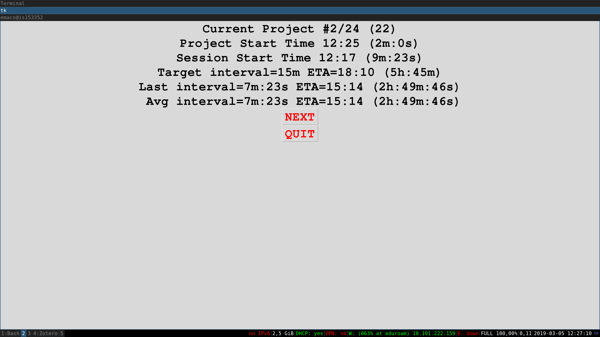

# jury_clock
A timekeeper to estimate the duration and end-time when evaluating a series of projects.

Supposing than you plan to assess 20 projects and that you expect to spend 12 minutes per projet: 

    python jury_clock.py --nprojects 20 --interval 15

Example of a screenshot:

    
